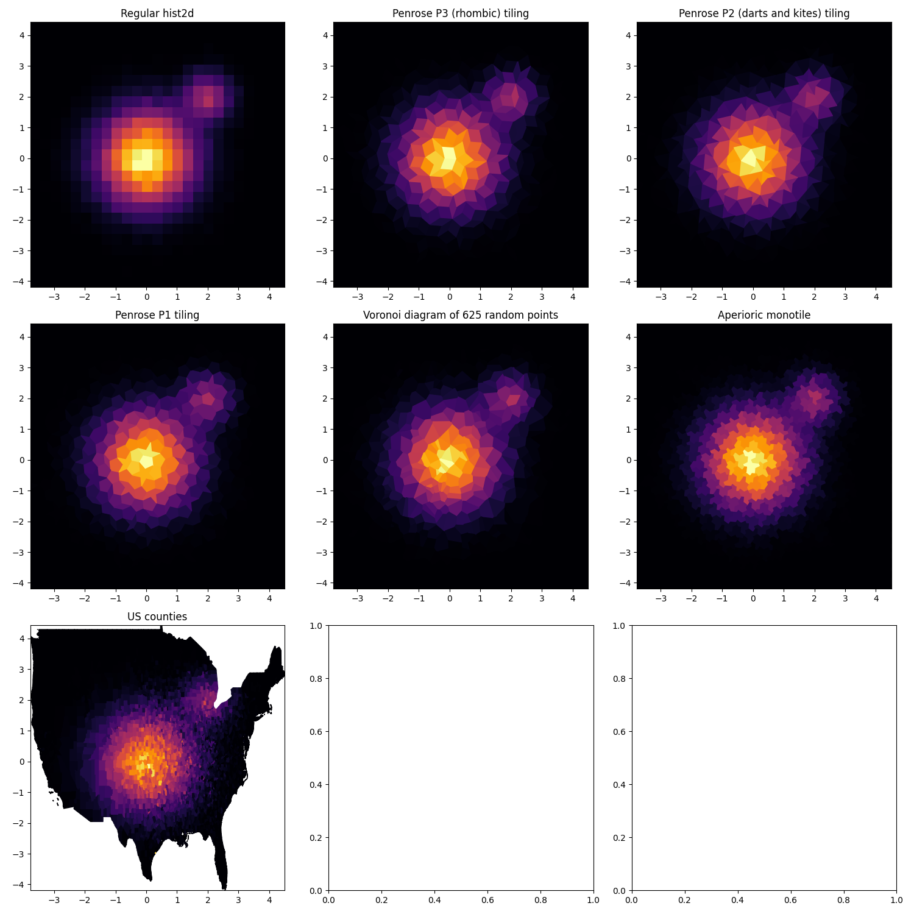

## Demo

## Ideas
- Penrose tilings
- Aperiodic monotile options
- random points' Voronoi diagram
- random line ensemble intersections
- world maps, any other fun map e.g. a super gerrymandered maps from US
- square grid with a very long and complicated name
- ???

## Refs:
- [hat tiling with SAT solver](https://www.hgreer.com/HatTile/)
- [very nice but very long article about P2, P3, hat](https://www.chiark.greenend.org.uk/~sgtatham/quasiblog/aperiodic-tilings/)
- [spectre generation in python](https://github.com/shrx/spectre/tree/master)
- [hats web app](https://cs.uwaterloo.ca/~csk/hat/h7h8.html)
- [spectre web app](https://cs.uwaterloo.ca/~csk/spectre/app.html)
