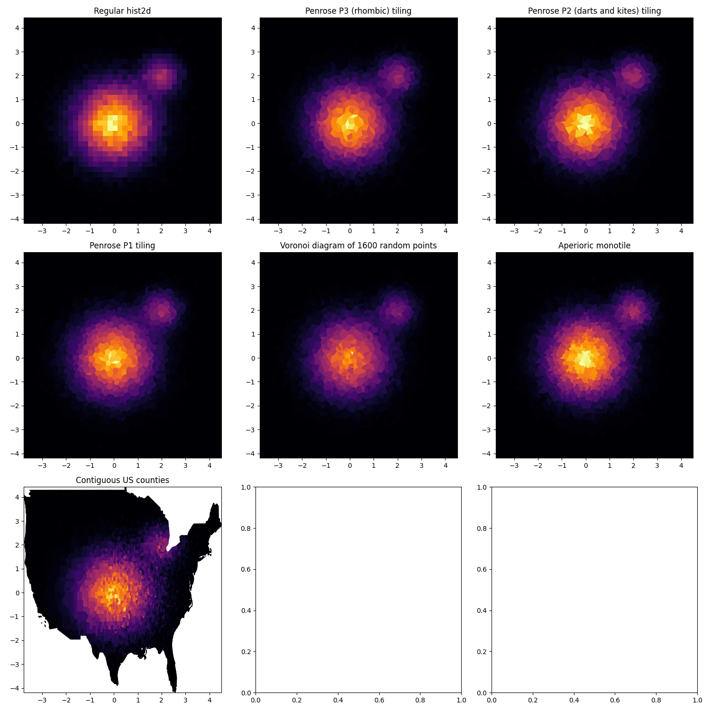

## Demo

## Ideas

- Penrose tilings
- Aperiodic monotile options
- random points' Voronoi diagram
- random line ensemble intersections
- world maps, any other fun map e.g. a super gerrymandered maps from US
- square grid with a very long and complicated name
- color-quantized and flood-filled photo
- black metal logos
- Fibonacci tiling
- ???

## Refs:

- [hat tiling with SAT solver](https://www.hgreer.com/HatTile/)
- [very nice but very long article about P2, P3, hat](https://www.chiark.greenend.org.uk/~sgtatham/quasiblog/aperiodic-tilings/)
- [spectre generation in python](https://github.com/shrx/spectre/tree/master)
- [hats web app](https://cs.uwaterloo.ca/~csk/hat/h7h8.html)
- [spectre web app](https://cs.uwaterloo.ca/~csk/spectre/app.html)
- [detailed penrose tiling article](https://www.ams.org/publicoutreach/feature-column/fcarc-penrose)
- [bob](https://scollins.net/penrose/)
- [P1 and P4 (novel)](https://arxiv.org/pdf/2505.14013)
- [P1 tiling rules](https://imgur.com/tNhJT4T)
- [very detailed BSc thesis on the topic](https://pcwww.liv.ac.uk/~hemraj/thesis/BSc/2021_Daniel_Gouldsbrough_BSc_Thesis.pdf)
- [KIPPI algorithm for polygon "extraction" from images](https://inria.hal.science/hal-01740958/file/kippi.pdf)

## Data sources

- [Hipparcus star catalog](https://www.kaggle.com/datasets/konivat/hipparcos-star-catalog?resource=download), see correct ref therein
